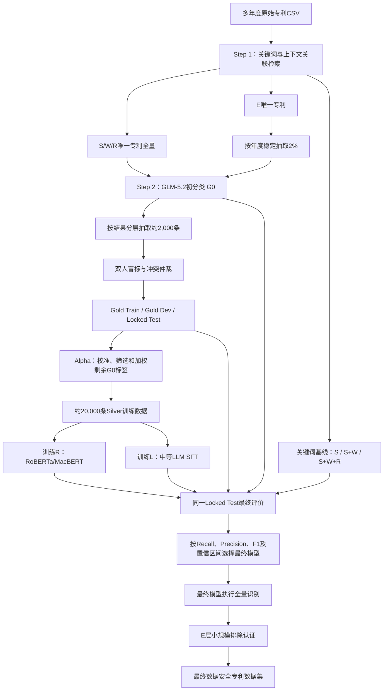

# 数据安全专利识别方法全流程

- 文档状态：方法设计基线
- 版本：1.0.0
- 更新日期：2026-07-12
- 适用范围：中国上市公司多年度专利文本的数据安全识别
- 最终目标：构建在人工真值上具有最高类别 1 召回率、同时满足预设精确率下限的专利识别器

## 1. 方法定位

本研究不预设关键词法、RoBERTa、MacBERT、Prompt-based LLM 或 SFT LLM 中的任何一种必然
成为最终方法。完整研究由五个相互隔离的部分构成：

1. Step 1 使用关键词和上下文关联检索形成 S/W/R/E 召回层级；
2. Step 2 使用 GLM-5.2 对 S/W/R 全量专利和 E 层 2% 稳定样本执行初始三分类；
3. 根据 Step 2 结果抽取约 2,000 件专利，双人独立标注并形成 Human Gold Corpus；
4. 使用 Gold Train/Dev 校准 GLM-5.2 标签质量，从剩余专利构建 Silver Set（步骤 Alpha）；
5. 使用相同训练资源分别训练 RoBERTa/MacBERT 学生模型和中等体量 SFT LLM，并在从未参与
   训练或调参的人工 Locked Test 上与关键词基线、GLM-5.2 基准进行比较。

最终识别器由预先登记的指标规则决定。中等体量 SFT LLM 是重要候选，但不得预先写定为最终
获胜模型。

## 2. 核心术语

| 符号或名称 | 含义 |
| --- | --- |
| S | Step 1 强相关召回层 |
| W | Step 1 弱相关召回层 |
| R | Step 1 泛相关召回层 |
| E | Step 1 未识别出相关信号的层级，不等于最终无关 |
| G0 | 当前冻结 Prompt 调用的 GLM-5.2，兼任初始教师和强模型基准 |
| G1 | 可选：保持 GLM-5.2 不变、仅优化 Prompt 后的版本；只有重新推理时才成立 |
| R | 使用 Gold 与 Silver 训练的 RoBERTa/MacBERT 监督分类器 |
| L | 使用 Gold 与 Silver 进行 SFT 的中等体量 LLM |
| Gold Corpus | 经过人工独立标注和冲突仲裁的数据 |
| Silver Set | 由 G0 生成并经人工 Gold 校准、筛选和加权的伪标签训练集 |
| Alpha | 从 Gold 误差分析到 Silver Set 生成的完整过程 |

如果更换基础模型，则该模型是新的候选模型，不能称为 G1。G1 只表示同一个 GLM-5.2 在 Prompt
层面的改进。

## 3. 总体流程



## 4. Step 1：关键词与上下文召回

### 4.1 分析字段

当前 Step 1 只扫描：

- 摘要文本；
- 主权项内容。

IPC 可作为 Step 2 的模型证据字段，但当前实现不把 IPC 当作 Step 1 关键词证据。若未来增加 IPC
路由，应单独提高 taxonomy 与方法版本，不能静默改变既有层级。

### 4.2 上下文关联

关键词命中不能脱离上下文直接决定层级。系统优先保存命中词所在完整句子；字段没有可靠句界时，
使用命中词左右各 48 个字符的窗口。每个命中保留词表 ID、命中位置、上下文片段、来源和范围。

### 4.3 S/W/R/E 的方法含义

S/W/R/E 是进入模型前的召回强度，不是最终分类标签：

- S/W/R：唯一专利全部进入 G0；
- E：在排除已经进入 S/W/R 的专利后，按唯一 `patent_id` 和固定 seed 稳定抽取 2%；
- E 样本保存 `selection_probability=0.02` 和 `sample_weight=50`；
- E 剩余总体暂不调用模型，待最终识别器确定后通过认证样本判断是否可以排除。

### 4.4 2021 年任务池实例

以下数字用于说明实际抽样结构，不作为未来年度的固定配额：

| 层级 | 唯一专利任务数 | Step 2 规则 |
| --- | ---: | --- |
| S | 997 | 全量 |
| W | 662 | 全量 |
| R | 8,636 | 全量 |
| E | 12,023 | 从 597,815 件 E 专利中稳定抽取 2% |
| 合计 | 22,318 | G0 初分类任务池 |

Gold、Silver 与模型训练均以唯一专利为分析单位，不能使用公司-专利关联行数代替专利数。

## 5. Step 2：GLM-5.2 初分类

### 5.1 G0 的角色

G0 有三个角色：

1. 为人工 Gold 抽样提供初始类别、置信度和状态变化信息；
2. 为后续学生模型生成 Silver 伪标签；
3. 作为最终模型竞赛中的强大模型基准。

G0 不是人工真值，也不预设为最终模型。

### 5.2 模型输入隔离

G0 只接收：

- 专利名称；
- 摘要；
- 主权项；
- IPC 分类号和主分类号。

关键词层级、关键词命中、上下文命中和 Step 1 诊断字段不得传给 G0，避免关键词先验锚定模型判断。

### 5.3 三分类定义

| 类别 | 定义 | 处理方式 |
| --- | --- | --- |
| 1 | A-B-C-D 证据链闭合，明确数据安全相关 | 明确正类候选 |
| 2 | 存在实质性正向证据，但机制、效果或中心性仍有关键缺口 | 拒判/复核状态，`review_flag=true` |
| 3 | 不满足类别 1 或类别 2 | 其他候选 |

A-B-C-D 分别表示保护对象或活动、安全目标或风险、技术机制、因果与发明中心性。G0 的
`confidence` 表示模型对当前分类的自评把握，不是统计置信度，也不能直接作为标签正确概率。

### 5.4 审计字段

每条 G0 结果至少保留：

```text
patent_id, year, keyword_level, selection_probability, sample_weight,
requested_model, actual_model, prompt_version, cat, confidence, subtype,
core_invention, evidence_chain, evidence, reason,
review_flag, review_reason, attempts, elapsed_seconds, process_status
```

## 6. Step 3：人工 Gold Corpus

### 6.1 抽样时点

人工样本在 G0 完成初分类后抽取，以利用最终的类别、置信度、`review_flag` 和 Step 1/G0 状态变化。
目标规模约为 2,000 件专利。

### 6.2 抽样结构

Gold 抽样同时包含两部分：

1. 代表性随机核心：按年度、S/W/R、G0 类别和置信度区间分层随机抽取；
2. 风险加抽：重点抽取 S/W/R -> 类别 3、S/W/R -> 类别 2、高置信冲突、罕见 subtype、
   `review_flag=true` 和多次请求后才成功的样本。

所有分层必须保存总体数、抽取数、入样概率、随机 seed 和评价权重。风险加抽样本不能直接以未加权
平均值代表总体表现。

E 不进入常规 Gold 的大规模标注。E 只在最终识别器确定后进行小规模排除认证，见第 11 节。

### 6.3 标注规则

- 两名标注者独立盲标；
- 首次提交前不显示 G0 类别、置信度、证据或理由；
- 标注依据与 G0 使用相同的数据安全实体定义和 A-B-C-D 证据链；
- 标注冲突由第三人或项目负责人仲裁；
- 报告原始一致率、Cohen's Kappa 或 Krippendorff's Alpha；
- 类别 2 是复核/拒判状态。人工仲裁应尽可能将其解析为最终类别 1 或 3；确实无法解析的样本保留
  `human_review_state=unresolved`，不得强行作为普通训练标签。

### 6.4 预先划分

建议在任何 Prompt 优化或模型训练前，将约 2,000 条 Gold 固定划分为：

| 分区 | 建议规模 | 允许用途 |
| --- | ---: | --- |
| Gold Train | 1,000 | G0 误差分析、Alpha 校准、R/L 训练 |
| Gold Dev | 400 | 阈值、Prompt、超参数与 Silver 规则选择 |
| Locked Test | 600 | 最终一次性模型评价，不得参与任何训练或调参 |

划分必须按年度、人工类别、S/W/R 层级和抽样分层进行。相同专利族、重复申请、明显文本近重复或相同
文本哈希必须进入同一分区，防止近重复泄漏。

## 7. 步骤 Alpha：从 G0 标签构建 Silver Set

### 7.1 Alpha 的目标与边界

Alpha 不对剩余约 20,000 条专利重新进行人工标注，也不依靠学生模型置信度证明标签正确。它使用
Gold Train/Dev 估计不同类型 G0 标签的可靠度，然后对剩余标签执行：

- 高质量标签保留；
- 中等质量标签降权；
- 类别 2、冲突或高风险标签排除或单独处理；
- 明显无效标签完全排除。

Silver 仍是伪标签，不是人工真值。Alpha 是否有效只能通过 Locked Test 上的消融实验证明。

### 7.2 防止泄漏

生成 Silver 前必须排除：

- 全部 Gold Train、Gold Dev 和 Locked Test 的 `patent_id`；
- 与任何 Gold 样本属于同一专利族的记录；
- 与 Gold 文本达到预设近重复阈值的记录。

当前 22,318 条任务扣除约 2,000 条 Gold 后，理论上最多约有 20,318 条 Silver 候选。不得为了凑满
20,000 条而接受低质量标签。

### 7.3 G0 误差画像

Gold Train 连接 G0 输出后，构造：

- G0 类别与人工最终标签的混淆矩阵；
- S/W/R × G0 类别的真实正确率；
- 原始 `confidence` 区间的实际正确率；
- `review_flag`、状态变化、subtype、年份和重试次数的错误率；
- G0 类别 3 中人工类别 1 的比例，即危险漏判率。

风险特征至少包括：

```text
glm_cat, raw_confidence, keyword_level, transition_type,
subtype, review_flag, evidence_valid, attempts, year
```

### 7.4 标签可靠度校准

在 Gold Train 上定义：

```text
correct_i = 1(GLM标签与人工最终标签一致)
q_i       = P(correct_i = 1 | X_i)
p1_i      = P(人工最终标签为类别1 | X_i)
```

可使用逻辑回归估计 `q_i` 和 `p1_i`，或按 G0 类别分别使用 Isotonic Regression 校准原始
`confidence`。约 1,000 条 Gold Train 不足以支持大量稀疏交互项；应使用从全局到类别、再到层级的
分层回退或收缩估计。

校准器只能在 Gold Train 拟合。Silver 接受阈值只能在 Gold Dev 选择。Locked Test 不得参与。

### 7.5 Silver 分级

建议为每条 Silver 候选赋予以下等级：

| 等级 | 典型条件 | 处理 |
| --- | --- | --- |
| A | 类别 1 或 3，证据有效，校准可靠度达到高阈值 | 硬标签，权重接近 1 |
| B | 可靠度中等，但没有关键冲突 | 保留并降权 |
| C | 类别 2、`review_flag=true`、状态冲突或漏判风险较高 | 不作为普通硬标签 |
| D | Schema、证据、请求或文本异常 | 完全排除 |

因为最终目标优先保证类别 1 召回率，正负标签采用非对称门槛：

- G0 类别 1：要求 `p1_i` 足够高，避免污染正样本；
- G0 类别 3：要求 `p1_i` 的上界足够低，避免把潜在类别 1 教成负样本；
- G0 类别 2：默认不转成普通硬标签，除非经过人工解析或有独立规则证明。

训练质量权重可从 `w_quality=q_i^2` 起步，并在 Gold Dev 上选择；还需要独立的类别平衡权重：

```text
w_final = w_quality × w_class
```

E 的 `sample_weight=50` 是总体推断权重，不能直接作为模型训练权重。

### 7.6 Gold Dev 质量门槛

将 Gold Dev 临时视为未知标签数据，先仅依据 G0 字段生成等级和权重，再揭示人工标签，报告：

- 各等级保留率；
- 各等级标签正确率及 95% 置信区间；
- 类别 1 Silver 的 Precision；
- 类别 3 中真实类别 1 的比例；
- 不同 Silver 规则下的质量-覆盖率曲线。

只有在门槛预先登记并通过 Gold Dev 后，才能冻结 Alpha 规则并应用于剩余约 20,000 条记录。

### 7.7 Alpha 产物

建议未来实现为独立步骤：

```text
data/step4/
├── teacher_error_by_stratum.csv
├── confidence_calibration.csv
├── calibration_report.json
├── silver_scored.csv
├── silver_grade_A.csv
├── silver_grade_B.csv
├── silver_excluded.csv
├── roberta_training.csv
└── sft_training.jsonl
```

`silver_scored.csv` 至少保留：

```text
patent_id, glm_cat, keyword_level, transition_type,
raw_confidence, calibrated_p_positive, calibrated_p_correct,
silver_grade, quality_weight, class_weight, final_training_weight,
exclusion_reason
```

## 8. 学生模型训练

### 8.1 统一训练资源

R 与 L 必须获得相同的基础监督信息：

- 相同的 Gold Train；
- 相同的 Silver 专利集合；
- 相同的最终硬标签；
- 相同的类别平衡原则；
- 相同的 Gold Dev 和 Locked Test。

RoBERTa/MacBERT 可直接使用逐样本损失权重。若 SFT 框架不支持逐样本权重，可通过只使用 A 级
Silver、按权重重采样或控制重复次数实现近似一致的训练强度。

### 8.2 R：RoBERTa/MacBERT 分类器

R 用于复现并改进既有论文中的“小模型学习 AI 标签”路线。主要结构为中文 RoBERTa 或 MacBERT
编码器加分类头。MacBERT/CoSENT 的主题相似度路线可作为附加历史基线，但不作为本研究主线。

### 8.3 L：中等体量 SFT LLM

L 是可实际获得 SFT 支持的中等体量模型。它是 G0 的学生候选，不是新的教师。中等模型经过任务专门
训练后可能超过 GLM-5.2，也可能因容量较小或继承伪标签错误而表现更差，必须以 Locked Test 为准。

### 8.4 训练消融

至少训练以下配置：

| 模型 | 训练数据 | 目的 |
| --- | --- | --- |
| R0 | 仅 Gold Train | RoBERTa/MacBERT 的人工标签基准 |
| Rα | Gold Train + Alpha Silver | 证明 Silver 对 R 的增益 |
| L0 | 仅 Gold Train SFT | 中等 LLM 的人工标签基准 |
| Lα | Gold Train + Alpha Silver | 证明 Silver 对 L 的增益 |

R 和 L 至少使用三个随机 seed，并报告均值、标准差和最佳配置选择规则。

## 9. 最终模型竞赛

### 9.1 候选方法

Locked Test 至少比较：

1. Keyword-S：仅 S 判为候选；
2. Keyword-SW：S+W 判为候选；
3. Keyword-SWR：S+W+R 判为候选；
4. G0：当前 GLM-5.2 裸调用；
5. 可选 G1：同一 GLM-5.2、优化 Prompt 后重新推理；
6. R0 与 Rα；
7. L0 与 Lα；
8. 可选 MacBERT/CoSENT 文献复现基线。

如果 G1 未对同一测试数据实际重新推理，则不能报告为独立候选。

### 9.2 指标与选择规则

主要指标为：

- 类别 1 Precision；
- 类别 1 Recall；
- 类别 1 F1；
- Macro-F1；
- 混淆矩阵；
- 类别 2 拒判/人工复核率；
- 自动判定覆盖率；
- 各指标 95% 置信区间。

由于最终目标优先追求召回率，建议在查看 Locked Test 前登记：

```text
先要求类别1 Precision达到预设下限 P_min；
在满足P_min的模型中选择类别1 Recall最高者；
Recall接近时再比较F1、Macro-F1和拒判率。
```

`P_min` 可在 Gold Dev 上确定并预先登记，例如 0.90 或 0.95，但不能查看 Locked Test 后修改。

模型差异采用逐条配对 Bootstrap 估计 Precision、Recall、F1 差值的置信区间；Accuracy 差异可辅以
McNemar 检验。抽样 Gold 指标必须使用入样概率或评价权重。

### 9.3 Alpha 的最终证明

Alpha 的有效性不由 Silver 数量或学生置信度证明，而由以下 Locked Test 对比证明：

```text
Rα > R0：Alpha Silver 对小模型有效；
Lα > L0：Alpha Silver 对 SFT 有效；
Lα、Rα、G0 的配对比较：确定最终识别器。
```

学生模型置信度只可用于 Gold Dev 阈值选择和后续复核排序。置信度变高而人工测试指标不提高，不构成
性能改进。

## 10. Locked Test 使用纪律

Locked Test 在划分后必须封存，禁止用于：

- Prompt 编写或选择；
- Silver 校准、筛选或权重设置；
- R/L 训练；
- 超参数、阈值或 checkpoint 选择；
- 失败后的直接规则修补。

Locked Test 只允许在所有候选配置冻结后执行一次正式评价。若根据测试结果重新开发方法，必须建立新的
独立测试集，不能继续把原 Locked Test 当作无偏最终证据。

## 11. E 层排除认证

E 不参加常规大规模 Gold 标注，但不能完全零人工验证。最终识别器确定后，对既有 2% E 样本重新分类，
再进行小规模认证：

- E -> 类别 1：原则上全部或高比例人工核验；
- E -> 类别 2：全部或高比例人工核验；
- E -> 类别 3：随机抽取认证样本，估计残余漏召率。

需要报告：

```text
p_E = P(人工类别1 | route=E)
E层漏召专利数量估计
p_E的95%置信区间上界
关键词S/W/R召回率的95%置信区间下界
```

预先设置验收条件：

```text
U95(p_E) <= δ
且
L95(Recall_keyword) >= τ
```

只有通过条件，才能在论文中说明普通 E 样本无需进一步人工标注。若未通过，应扩大 E 样本、修改 Step 1
词表或上下文规则，并使用新的独立样本重新验证。

## 12. 最终全量识别

模型竞赛和 E 层认证完成后：

1. 锁定最终模型、模型版本、Prompt/训练配置和决策阈值；
2. 用最终模型重新识别所有年度 S/W/R 唯一专利；
3. 对模型拒判和最终状态变化样本建立可审计复核队列；
4. 合并人工 `final_label`、模型输出、抽样概率和过程状态；
5. 按申请号映射回公司-专利关系；
6. 构造企业-年度数据安全创新数量、质量或加权指标；
7. 进入后续计量模型和稳健性检验。

## 13. 推荐实施文件结构

当前代码已实现 Step 1 和 Step 2。后续开发应继续保持“一步一个脚本、一步一个数据目录”：

```text
scripts/
├── step1_keyword_extraction.py
├── step2_llm_classification.py
├── step3_gold_sampling.py
├── step4_silver_construction.py
├── step5_train_roberta.py
├── step5_train_sft.py
├── step6_model_evaluation.py
└── step7_final_inference.py

data/
├── raw/
├── step1/
├── step2/
├── step3/
├── step4/
├── step5/
├── step6/
└── step7/
```

在相应步骤真正开发前，不预先创建空数据目录或无效脚本。

## 14. 可复现性清单

论文和附录至少披露：

- 原始数据范围、年份和唯一专利去重规则；
- 关键词 taxonomy 版本及上下文策略；
- E 抽样概率、seed 和样本权重；
- G0 模型名、实际模型版本、Prompt 版本和推理参数；
- 人工标注指南、标注者人数、一致性和仲裁方式；
- Gold 抽样分层、入样概率和 Train/Dev/Test 划分 seed；
- 专利族及近重复隔离规则；
- Alpha 校准模型、Silver 门槛、等级和训练权重；
- R/L 模型版本、训练参数、随机 seed 和 checkpoint 规则；
- Locked Test 指标、置信区间和配对显著性检验；
- E 层漏召率上界和召回率下界；
- 失败请求、拒判样本和人工修正记录。

## 15. 与既有论文方法的关系

皮淑雯等（2026）采用生成式 AI 标注 10,000 条专利，再按 8:1:1 训练和评价 RoBERTa，为“AI 标注与
小模型训练”提供了直接先例。但公开正文没有充分说明人工样本如何进入训练、验证和测试，也没有明确
测试集真值是否完全独立于 AI 标签。本研究通过人工 Locked Test、Silver 质量校准和消融实验补足该证据链。

蒋伟杰等（2026）使用 MacBERT/CoSENT 对专利摘要和预定主题进行相似度匹配，并借助人工检验选择阈值。
本研究保留其作为历史对照，但数据安全识别具有多子类和强边界判别特征，因此主线采用监督分类与 SFT，
不使用单一主题相似度作为最终方法。

Alpha 在方法上属于伪标签、自训练和知识蒸馏范畴。Silver 负责扩展监督规模，人工 Locked Test 负责提供
独立真值；二者职责必须严格分开。

## 16. 方法成立的最低条件

只有同时满足以下条件，才能声称最终识别器优于裸 GLM-5.2 和传统方法：

1. 人工 Locked Test 从未进入 Prompt 优化、Silver 构建或学生训练；
2. R/L 与 G0 在同一测试样本上配对评价；
3. 最终模型达到预设 Precision 下限；
4. 类别 1 Recall 或 F1 的提升具有置信区间和配对检验证据；
5. Alpha 消融显示 Silver 对学生模型产生真实增益；
6. E 层认证支持 Step 1 未召回部分的风险足够低；
7. 全过程可以由固定版本、seed、数据清单和日志复现。

如果 L 未在 Locked Test 上优于 G0 或 R，则不能因为它支持 SFT、成本更低或更易部署而宣称其识别质量
更高。最终方法必须服从人工真值上的实际结果。

## 17. 参考方法来源

1. 皮淑雯等：《员工流失风险感知与企业劳动节约型创新》，《南开管理评论》，2026，29(4)：
   113-124。
2. 蒋伟杰等：《算法创新与企业全要素生产率提升——来自专利文本的经验证据》，2026，
   DOI：[10.13653/j.cnki.jqte.20260515.001](https://doi.org/10.13653/j.cnki.jqte.20260515.001)。
3. Hinton, G., Vinyals, O., & Dean, J. (2015). [Distilling the Knowledge in a Neural
   Network](https://arxiv.org/abs/1503.02531).
4. Xie, Q., Luong, M.-T., Hovy, E., & Le, Q. V. (2020). [Self-Training With Noisy Student
   Improves ImageNet Classification](https://openaccess.thecvf.com/content_CVPR_2020/html/Xie_Self-Training_With_Noisy_Student_Improves_ImageNet_Classification_CVPR_2020_paper.html).
