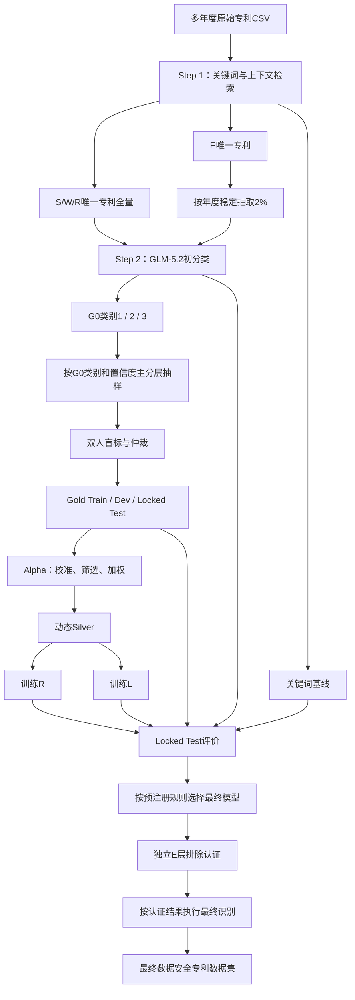

# 数据安全专利识别方法全流程

- 文档状态：精简方法基线（基于 2021 年真实数据）
- 版本：1.3.0
- 更新日期：2026-07-13
- 适用范围：中国上市公司多年度专利文本的数据安全识别
- 目标：在人工真值上最大化类别 1 Recall，同时满足预设 Precision 下限

## 1. 方法概览

1. Step 1：关键词与上下文检索，形成 S/W/R/E 路由；
2. Step 2：GLM-5.2（G0）对 S/W/R 全量和 E 层 2% 样本执行三分类；
3. Step 3：以 G0 类别 1/2/3 和置信度为主分层，抽取并人工标注 Gold；
4. Alpha：用 Gold Train/Dev 校准剩余 G0 标签，形成动态 Silver；
5. 训练 R（RoBERTa/MacBERT）和 L（中等体量 SFT LLM），在 Locked Test 上与关键词法和 G0 比较。

## 2. 核心术语

| 名称 | 含义 |
| --- | --- |
| S/W/R | Step 1 的强相关、弱相关、泛相关召回层 |
| E | Step 1 未识别相关信号的层级，不等于最终无关 |
| G0 | 当前冻结 Prompt 调用的 GLM-5.2；初始教师和强模型基准 |
| G1 | 同一 GLM-5.2 仅优化 Prompt 后重新推理的可选版本 |
| R | 使用 Gold 与 Silver 训练的 RoBERTa/MacBERT 分类器 |
| L | 使用 Gold 与 Silver 进行 SFT 的中等体量 LLM |
| Gold | 经双人独立标注和冲突仲裁的数据 |
| Silver | 经 Gold 校准、筛选和加权的 G0 伪标签 |
| Alpha | 从 G0 误差校准到 Silver 生成的过程 |

## 3. 总体流程



## 4. Step 1：关键词与上下文召回

### 4.1 检索规则

- 扫描字段：摘要、主权项；
- 命中证据：优先保存完整句子；无可靠句界时保存命中词左右各 48 个字符；
- 审计信息：词表 ID、命中位置、上下文、字段来源和范围；
- IPC 仅作为 Step 2 证据字段，不参与当前 Step 1 路由。

### 4.2 路由与抽样

- S/W/R 唯一专利全量进入 G0；
- E 排除 S/W/R 后，按 `patent_id` 和固定 seed 稳定抽取 2%；
- E 样本保存 `selection_probability=0.02`、`sample_weight=50`；
- 分析单位为唯一专利，不使用公司—专利关联行数。

| 2021 路由 | Step 2 任务数 | 规则 |
| --- | ---: | --- |
| S | 997 | 全量 |
| W | 662 | 全量 |
| R | 8,636 | 全量 |
| E | 12,023 | 从 597,815 件 E 专利中抽取 2% |
| 合计 | 22,318 | G0 任务池 |

## 5. Step 2：G0 三分类

### 5.1 输入隔离

G0 只接收专利名称、摘要、主权项、IPC 分类号和主分类号，不接收关键词层级、命中词或 Step 1 诊断字段。

### 5.2 标签定义

| 类别 | 定义 | 用途 |
| --- | --- | --- |
| 1 | A-B-C-D 证据链闭合，明确数据安全相关 | 正类候选 |
| 2 | 有实质性正向证据，但机制、效果或中心性仍有缺口 | 拒判/复核，`review_flag=true` |
| 3 | 不满足类别 1 或类别 2 | 其他候选 |

A-B-C-D 分别表示保护对象或活动、安全目标或风险、技术机制、因果与发明中心性。`confidence` 是模型自评，
不是统计置信度或标签正确概率。

### 5.3 审计字段

```text
patent_id, year, keyword_level, selection_probability, sample_weight,
requested_model, actual_model, prompt_version, cat, confidence, subtype,
core_invention, evidence_chain, evidence, reason,
review_flag, review_reason, attempts, elapsed_seconds, process_status
```

## 6. Step 3：人工 Gold

### 6.1 抽样总体与真实数据

Gold 抽样框为全部成功完成 Step 2 的唯一专利，包括 E 层 2% 样本。主分层变量是 G0 类别、置信度、
`subtype` 和 `review_flag`；S/W/R/E 只作为辅助变量和第一阶段抽样概率来源。

2021 年 Step 2 共 22,318 条，成功率 100%，failed 和 pending 均为 0：

| G0 类别 | 2021 实际 | 占比 | 8 年同规模 | 10 年同规模 |
| --- | ---: | ---: | ---: | ---: |
| 类别 1 | 4,217 | 18.895% | 33,736 | 42,170 |
| 类别 2 | 316 | 1.416% | 2,528 | 3,160 |
| 类别 3 | 17,785 | 79.689% | 142,280 | 177,850 |
| 合计 | 22,318 | 100% | 178,544 | 223,180 |

| Step 1 路由 | 类别 1 | 类别 2 | 类别 3 | 合计 |
| --- | ---: | ---: | ---: | ---: |
| S | 662 | 51 | 284 | 997 |
| W | 388 | 27 | 247 | 662 |
| R | 3,128 | 233 | 5,275 | 8,636 |
| E 的 2% 样本 | 39 | 5 | 11,979 | 12,023 |
| 合计 | 4,217 | 316 | 17,785 | 22,318 |

E 中的 39 条类别 1 和 5 条类别 2 属于 Step 1 潜在漏召，必须具备进入 Gold 的资格。

现有 `step3-gold-v1.0.0` 的 2,000 条 pilot 只来自 S/W/R，G0 类别为 694/233/1,073。正式 Gold 应提高
sampling version，从全部 Step 2 结果重新抽样，并保留旧 pilot 审计文件。

### 6.2 理论依据

本设计是“低成本代理分类 + 高成本人工验证”的两相分层抽样：

- Neyman（1934）和 Cochran（1977）：分层随机抽样与最优分配；
- Breslow 与 Chatterjee（1999）：第二阶段按第一阶段结果和协变量联合分层可提高验证效率；
- Horvitz 与 Thompson（1952）：不等概率抽样使用逆入样概率加权；
- Lewis 与 Gale（1994）：在特定 newswire 任务中，uncertainty sampling 最多减少约 500 倍人工训练数据；
- Kumar 与 Raj（2018）：其实验中分层策略相对随机抽样降低超过 65% 的估计方差，并在 1% 误差目标下
  最多减少约 60% 标注量。

G0 类别 1/2/3 是最接近人工标签的第一阶段代理结果，因此作为主分层；S/W/R/E 仅在控制 G0 类别和
置信度后仍能解释人工错误率差异时，才作为次级分层。

Gold 包含两部分：

1. 代表性随机核心：`年度 × G0类别 × 置信度` 分层随机抽取；
2. 风险加抽：类别 2、route–G0 冲突、低置信、罕见 subtype、重试或 Schema 异常。

从 22,318 条中简单随机抽取 2,000 条时：

| 层/风险组 | 总体数 | 随机抽样期望数 | 抽到 0 条概率 | 处理 |
| --- | ---: | ---: | ---: | --- |
| G0 类别 1 | 4,217 | 377.90 | 近似 0 | 主分层 |
| G0 类别 2 | 316 | 28.32 | `<10^-10` | 主分层并加抽 |
| G0 类别 3 | 17,785 | 1,593.78 | 0 | 概率核心抽取 |
| E → 类别 1/2 | 44 | 3.94 | 1.600% | 冲突层优先核验 |
| `data_governance` subtype | 21 | 1.88 | 13.910% | 罕见 subtype 加抽 |

分层设计增加少数类和风险样本的信息量；总体比例、错误率和模型指标必须使用抽样权重。

### 6.3 Gold 动态数量

令 `N` 为成功完成 Step 2 的唯一专利数，`Y` 为年度数：

```text
z = 1.96
p = 0.50
e_overall = 0.025
e_year = 0.05
DEFF_plan = 1.0

n0 = z^2 × p × (1-p) / e_overall^2
n_FPC = ceil(n0 / (1 + (n0-1)/N))
n_year = ceil(z^2 × 0.25 / e_year^2) × Y = 385 × Y
n_base = max(1500, n_FPC, n_year)
n_core = min(N, ceil(DEFF_plan × n_base))
n_risk = min(N-n_core, ceil(n_core/3))
n_gold = n_core + n_risk
```

`n_FPC` 为有限总体修正；每年最低 385 条对应最坏 `p=0.5` 时约 ±5 个百分点的 SRS 等效精度；获得
人工标签后，用实际设计效应更新 `DEFF_plan`。核心下限 1,500 和风险量 `n_core/3` 是本项目规划参数，
不是通用统计常数。

| 情景 | Step 2 的 `N` | `n_FPC` | 随机核心 | 风险加抽 | Gold | Gold/Step 2 |
| --- | ---: | ---: | ---: | ---: | ---: | ---: |
| 2021 | 22,318 | 1,438 | 1,500 | 500 | 2,000 | 8.96% |
| 8 年同规模 | 178,544 | 1,524 | 3,080 | 1,027 | 4,107 | 2.30% |
| 10 年同规模 | 223,180 | 1,527 | 3,850 | 1,284 | 5,134 | 2.30% |

### 6.4 分层与风险配额

随机核心先保证每年 385 条，再按 G0 类别和置信度区间分配。置信度区间为 `<0.80`、`[0.80,0.90)`、
`[0.90,0.98)`、`[0.98,1.00]`；罕见 subtype 定义为 `N_subtype/N <= 1%`。

风险条件按 route–G0 冲突、类别 2/复核、低置信类别 1/3、罕见 subtype、请求/Schema 异常的顺序归入
唯一主风险组。配额不足的风险组全取，余额按原权重重新分配；下列权重是预注册设计参数，不是文献常数。

| 风险组 | 权重 | 2021：500 | 8 年：1,027 | 10 年：1,284 |
| --- | ---: | ---: | ---: | ---: |
| route–G0 冲突 | 24% | 120 | 247 | 308 |
| 类别 2/`review_flag` | 36% | 180 | 370 | 462 |
| 低置信类别 1/3 | 16% | 80 | 164 | 206 |
| 罕见 subtype | 12% | 60 | 123 | 154 |
| 请求或 Schema 异常 | 12% | 60 | 123 | 154 |
| 合计 | 100% | 500 | 1,027 | 1,284 |

route–G0 冲突先纳入全部 `E → 类别1/2`，再从 `S/W → 类别3` 中概率抽取。2021 年先纳入 44 条 E 冲突，
其余 76 条从 S/W 冲突中抽取。

最终互斥细分层为：

```text
年度 × G0类别 × 置信度区间 × 主风险组
```

每层不放回随机抽样，保存 seed、`N_h`、`n_h`、入样概率和权重。S/W/R/E 保留为审计字段，并可在人工
pilot 证明存在条件异质性后加入次级分层。

### 6.5 两阶段权重

```text
π_step3,i = n_h / N_h
w_step2,i = 1 / π_step3,i

p_step2,i = 1.00  if route in {S,W,R}
p_step2,i = 0.02  if route = E
π_total,i = p_step2,i × π_step3,i
w_full,i = 1 / π_total,i
```

- `w_step2`：推断已完成 G0 的 Step 2 任务池；
- `w_full`：推断完整专利总体；
- E 的 `sample_weight=50` 只用于总体推断，不作为训练损失权重。

### 6.6 人工标注与数据划分

- 两名标注者独立盲标，首次提交前隐藏 G0 输出；
- 使用与 G0 相同的实体定义和 A-B-C-D 证据链；
- 冲突由第三人或项目负责人仲裁；
- 报告原始一致率及 Cohen's Kappa 或 Krippendorff's Alpha；
- 类别 2 尽量仲裁为 1 或 3；无法解析者标记 `human_review_state=unresolved`，不作为普通硬标签。

正式 Locked Test 按类别 1 Recall 的区间精度规划：

```text
R_plan = 0.90
d_R = 0.03
m_positive = ceil(z^2 × R_plan × (1-R_plan) / d_R^2) = 385

pi_positive_plan = 0.30
n_test = max(ceil(385/0.30), 100×Y) = max(1284, 100×Y)
n_dev = max(400, ceil(0.20×n_gold))
n_train = n_gold - n_test - n_dev
```

`pi_positive_plan=0.30` 是分层加抽后的容量参数，不是总体正类率。按 Buderer（1996），Recall 精度取决于
测试集中人工正类数量。评价权重的有效正类样本量为：

```text
n_eff,+ = (Σw_i)^2 / Σw_i^2
```

若人工正类数或 `n_eff,+` 小于 385，应增加独立 Gold Test。

| 情景 | Gold Train | Gold Dev | Locked Test | 合计 |
| --- | ---: | ---: | ---: | ---: |
| 2021 pilot | 1,000 | 400 | 600 | 2,000 |
| 8 年正式规划 | 2,001 | 822 | 1,284 | 4,107 |
| 10 年正式规划 | 2,823 | 1,027 | 1,284 | 5,134 |

划分按年度、人工类别和抽样细分层平衡，以专利族/近重复组为不可拆分单元，并保留 Locked Test 权重。

## 7. Alpha：构建 Silver

### 7.1 候选总体

Silver 候选为排除 Gold 及泄漏关联记录后的全部成功 Step 2 标签，包括 E 的 2% 样本。E 标签必须通过
route-specific 校准门槛，不能自动作为负类。

| 情景 | Step 2 总体 | Gold | Gold Train | Silver 候选上限 |
| --- | ---: | ---: | ---: | ---: |
| 2021 | 22,318 | 2,000 | 1,000 | 20,318 |
| 8 年同规模 | 178,544 | 4,107 | 2,001 | 174,437 |
| 10 年同规模 | 223,180 | 5,134 | 2,823 | 218,046 |

```text
C = 全部成功Step 2标签 - Gold及其专利族/近重复
Silver = {i in C:
          grade_i in {A,B}, glm_cat_i in {1,3},
          review_flag_i=false, evidence_valid_i=true,
          且类别非对称校准门槛通过}

n_training = n_gold_train + |Silver|
```

候选上限尚未扣除类别 2、异常、泄漏关联和未通过校准门槛的记录；正式 Gold 冻结后重新计算实际数量。

### 7.2 G0 误差画像与校准

Gold Train 至少统计：

- G0 与人工标签的混淆矩阵；
- `S/W/R/E × G0类别`、置信度、subtype、年份、`review_flag` 和 attempts 的错误率；
- G0 类别 3 中人工类别 1 的比例。

```text
X_i = {glm_cat, raw_confidence, keyword_level, transition_type,
       subtype, review_flag, evidence_valid, attempts, year}

correct_i = 1(G0标签与人工最终标签一致)
q_i  = P(correct_i = 1 | X_i)
p1_i = P(人工最终标签为类别1 | X_i)
```

可用逻辑回归估计 `q_i`、`p1_i`，或按 G0 类别使用 Isotonic Regression 校准 `confidence`。校准器只在
Gold Train 拟合，阈值只在 Gold Dev 选择；使用分层回退或收缩限制稀疏交互项。

### 7.3 Silver 分级与权重

| 等级 | 条件 | 处理 |
| --- | --- | --- |
| A | 类别 1/3、证据有效、校准可靠度高 | 硬标签，权重接近 1 |
| B | 可靠度中等，无关键冲突 | 保留并降权 |
| C | 类别 2、复核或漏判风险高 | 不作为普通硬标签 |
| D | Schema、证据、请求或文本异常 | 排除 |

- 类别 1：要求 `p1_i` 达到正类 Precision 门槛；
- 类别 3：要求 `p1_i` 上界足够低；
- 类别 2：默认不转为普通硬标签。

```text
w_quality = q_i^2
w_final = w_quality × w_class
```

`w_quality` 的形式和门槛在 Gold Dev 上确定；E 的总体推断权重 50 不进入训练权重。

### 7.4 泄漏、质量门槛与训练量

Silver 生成前排除：

- 全部 Gold Train、Dev、Locked Test 的 `patent_id`；
- 与 Gold 同一专利族的记录；
- 达到预设文本近重复阈值的记录。

Gold Dev 报告各等级保留率、标签正确率及 95% CI、类别 1 Silver Precision、类别 3 漏判率和质量—覆盖率
曲线。E 层单独通过门槛后才可进入 Silver。

按 Figueroa 等（2012）的学习曲线方法，至少比较 Gold-only 以及 25%、50%、75%、100% 合格 Silver；
最终训练量由 Dev 学习曲线和 Locked Test 消融决定。

### 7.5 Alpha 产物

```text
data/step4/
├── teacher_error_by_stratum.csv
├── confidence_calibration.csv
├── calibration_report.json
├── silver_scored.csv
├── silver_grade_A.csv
├── silver_grade_B.csv
├── silver_excluded.csv
├── roberta_training.csv
└── sft_training.jsonl
```

`silver_scored.csv` 至少包含：

```text
patent_id, glm_cat, keyword_level, transition_type,
raw_confidence, calibrated_p_positive, calibrated_p_correct,
silver_grade, quality_weight, class_weight, final_training_weight,
exclusion_reason
```

## 8. 学生模型训练

R 与 L 使用相同的 Gold Train、Silver 专利、硬标签、类别平衡原则、Gold Dev 和 Locked Test。R 可直接
使用逐样本损失权重；SFT 不支持时，使用 A 级 Silver、按权重重采样或控制重复次数。

| 模型 | 训练数据 | 目的 |
| --- | --- | --- |
| R0 | Gold Train | RoBERTa/MacBERT 人工标签基准 |
| Rα | Gold Train + Alpha Silver | 检验 Silver 对 R 的增益 |
| L0 | Gold Train SFT | 中等 LLM 人工标签基准 |
| Lα | Gold Train + Alpha Silver | 检验 Silver 对 L 的增益 |

R 和 L 至少使用 3 个随机 seed，报告均值、标准差和 checkpoint 选择规则。

## 9. 最终评价与模型选择

### 9.1 候选方法

1. Keyword-S、Keyword-SW、Keyword-SWR；
2. G0；
3. 可选 G1（同一 GLM-5.2 优化 Prompt 后重新推理）；
4. R0、Rα、L0、Lα；
5. 可选 MacBERT/CoSENT 历史基线。

### 9.2 指标与选择规则

报告类别 1 Precision、Recall、F1、Macro-F1、混淆矩阵、类别 2 拒判率、自动判定覆盖率及 95% CI。

```text
先要求类别1 Precision >= P_min；
在满足P_min的模型中选择类别1 Recall最高者；
Recall接近时比较F1、Macro-F1和拒判率。
```

`P_min` 在 Gold Dev 上确定并预注册。模型差异使用逐条配对 Bootstrap；Accuracy 可辅以 McNemar 检验；
总体指标使用抽样权重。

Alpha 的证据来自同一 Locked Test 上的消融：

```text
Rα vs R0：Silver 对 R 的增益
Lα vs L0：Silver 对 L 的增益
Lα、Rα、G0：选择最终识别器
```

### 9.3 Locked Test 纪律

Locked Test 仅在候选配置冻结后正式评价一次，不参与：

- Prompt、Silver 规则或阈值选择；
- R/L 训练、超参数或 checkpoint 选择；
- 失败后的规则修补。

使用测试结果继续开发时，必须建立新的独立测试集。

## 10. E 层认证与最终识别

从未进入 Step 2 的 E 总体中使用新 seed 抽取独立认证样本，与 Gold、Silver 和 Locked Test 隔离。使用
最终模型分类后：

- E → 类别 1/2：全部或高比例人工核验；
- E → 类别 3：随机核验，估计残余漏召率。

报告：

```text
p_E = P(人工类别1 | route=E)
E层漏召专利数量估计
U95(p_E)
L95(Recall_keyword)
```

预注册验收条件：

```text
U95(p_E) <= δ
且
L95(Recall_keyword) >= τ
```

认证通过时，对全部年度 S/W/R 唯一专利执行最终模型；未通过时，扩大 E 的识别与复核范围。最终输出合并
`final_label`、模型结果、抽样概率和过程状态，再映射回公司—专利关系并构造企业—年度指标。

## 11. 可复现性清单

- 数据范围、年份、唯一专利去重规则；
- taxonomy、上下文策略和 E 抽样 seed/概率；
- G0 模型、Prompt、推理参数和失败记录；
- 人工标注指南、一致性和仲裁；
- Gold 分层、入样概率、划分 seed、专利族和近重复隔离；
- Alpha 校准器、Silver 门槛、等级和训练权重；
- R/L 训练参数、随机 seed 和 checkpoint 规则；
- Locked Test 指标、置信区间和配对检验；
- E 层漏召率上界与关键词召回率下界。

## 12. 与既有方法的关系

- 皮淑雯等（2026）：生成式 AI 标注专利并训练 RoBERTa；本研究增加独立人工 Gold、Silver 校准和
  Locked Test；
- 蒋伟杰等（2026）：MacBERT/CoSENT 主题相似度匹配；本研究将其作为历史基线；
- Alpha 属于伪标签、自训练和知识蒸馏；其有效性由 Rα/R0、Lα/L0 消融证明。

## 13. 参考文献

1. 皮淑雯等：《员工流失风险感知与企业劳动节约型创新》，《南开管理评论》，2026，29(4)：113-124。
2. 蒋伟杰等：《算法创新与企业全要素生产率提升——来自专利文本的经验证据》，2026，
   DOI：[10.13653/j.cnki.jqte.20260515.001](https://doi.org/10.13653/j.cnki.jqte.20260515.001)。
3. Hinton, G., Vinyals, O., & Dean, J. (2015). [Distilling the Knowledge in a Neural
   Network](https://arxiv.org/abs/1503.02531).
4. Xie, Q., Luong, M.-T., Hovy, E., & Le, Q. V. (2020). [Self-Training With Noisy Student
   Improves ImageNet Classification](https://openaccess.thecvf.com/content_CVPR_2020/html/Xie_Self-Training_With_Noisy_Student_Improves_ImageNet_Classification_CVPR_2020_paper.html).
5. Neyman, J. (1934). [On the Two Different Aspects of the Representative Method: The Method
   of Stratified Sampling and the Method of Purposive Selection](https://doi.org/10.1111/j.2397-2335.1934.tb04184.x).
   *Journal of the Royal Statistical Society*, 97(4), 558-606.
6. Cochran, W. G. (1977). [*Sampling Techniques*, 3rd ed.](https://www.wiley-vch.de/en/areas-interest/mathematics-statistics/sampling-techniques-978-0-471-16240-7).
   Wiley, ISBN 978-0-471-16240-7.
7. Horvitz, D. G., & Thompson, D. J. (1952). [A Generalization of Sampling Without Replacement
   from a Finite Universe](https://doi.org/10.1080/01621459.1952.10483446). *Journal of the
   American Statistical Association*, 47(260), 663-685.
8. Breslow, N. E., & Chatterjee, N. (1999). [Design and Analysis of Two-Phase Studies with
   Binary Outcome Applied to Wilms Tumour Prognosis](https://doi.org/10.1111/1467-9876.00165).
   *Journal of the Royal Statistical Society: Series C*, 48(4), 457-468.
9. Lewis, D. D., & Gale, W. A. (1994). [A Sequential Algorithm for Training Text
   Classifiers](https://doi.org/10.1007/978-1-4471-2099-5_1). *SIGIR '94*, 3-12.
10. Kumar, A., & Raj, B. (2018). [Classifier Risk Estimation Under Limited Labeling
    Resources](https://doi.org/10.1007/978-3-319-93034-3_1). *PAKDD 2018*, 3-15.
11. Buderer, N. M. F. (1996). [Statistical Methodology: I. Incorporating the Prevalence of
    Disease into the Sample Size Calculation for Sensitivity and
    Specificity](https://doi.org/10.1111/j.1553-2712.1996.tb03538.x). *Academic Emergency
    Medicine*, 3(9), 895-900.
12. Figueroa, R. L., Zeng-Treitler, Q., Kandula, S., & Ngo, L. H. (2012). [Predicting Sample
    Size Required for Classification Performance](https://doi.org/10.1186/1472-6947-12-8).
    *BMC Medical Informatics and Decision Making*, 12, Article 8.
