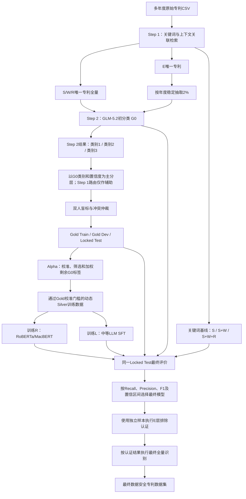

# 数据安全专利识别方法全流程

- 文档状态：方法设计基线（已按 2021 年真实运行数据修订）
- 版本：1.2.0
- 更新日期：2026-07-13
- 适用范围：中国上市公司多年度专利文本的数据安全识别
- 最终目标：构建在人工真值上具有最高类别 1 召回率、同时满足预设精确率下限的专利识别器

## 1. 方法定位

本研究不预设关键词法、RoBERTa、MacBERT、Prompt-based LLM 或 SFT LLM 中的任何一种必然
成为最终方法。完整研究由五个相互隔离的部分构成：

1. Step 1 使用关键词和上下文关联检索形成 S/W/R/E 召回层级；
2. Step 2 使用 GLM-5.2 对 S/W/R 全量专利和 E 层 2% 稳定样本执行初始三分类；
3. 根据 Step 2 的实际年度数、G0 类别 1/2/3 总体量和风险层规模动态确定 Gold 数量，双人独立标注并形成
   Human Gold Corpus；2021 年流程试验冻结为 2,000 件，8–10 个同规模年度的正式设计约为
   4,107–5,134 件；
4. 使用 Gold Train/Dev 校准 GLM-5.2 标签质量，从剩余 Step 2 专利动态构建 Silver Set（步骤
   Alpha），不预先指定固定的 Silver 条数；
5. 使用相同训练资源分别训练 RoBERTa/MacBERT 学生模型和中等体量 SFT LLM，并在从未参与
   训练或调参的人工 Locked Test 上与关键词基线、GLM-5.2 基准进行比较。

最终识别器由预先登记的指标规则决定。中等体量 SFT LLM 是重要候选，但不得预先写定为最终
获胜模型。

## 2. 核心术语

| 符号或名称 | 含义 |
| --- | --- |
| S | Step 1 强相关召回层 |
| W | Step 1 弱相关召回层 |
| R | Step 1 泛相关召回层 |
| E | Step 1 未识别出相关信号的层级，不等于最终无关 |
| G0 | 当前冻结 Prompt 调用的 GLM-5.2，兼任初始教师和强模型基准 |
| G1 | 可选：保持 GLM-5.2 不变、仅优化 Prompt 后的版本；只有重新推理时才成立 |
| R | 使用 Gold 与 Silver 训练的 RoBERTa/MacBERT 监督分类器 |
| L | 使用 Gold 与 Silver 进行 SFT 的中等体量 LLM |
| Gold Corpus | 经过人工独立标注和冲突仲裁的数据 |
| Silver Set | 由 G0 生成并经人工 Gold 校准、筛选和加权的伪标签训练集 |
| Alpha | 从 Gold 误差分析到 Silver Set 生成的完整过程 |

如果更换基础模型，则该模型是新的候选模型，不能称为 G1。G1 只表示同一个 GLM-5.2 在 Prompt
层面的改进。

## 3. 总体流程



## 4. Step 1：关键词与上下文召回

### 4.1 分析字段

当前 Step 1 只扫描：

- 摘要文本；
- 主权项内容。

IPC 可作为 Step 2 的模型证据字段，但当前实现不把 IPC 当作 Step 1 关键词证据。若未来增加 IPC
路由，应单独提高 taxonomy 与方法版本，不能静默改变既有层级。

### 4.2 上下文关联

关键词命中不能脱离上下文直接决定层级。系统优先保存命中词所在完整句子；字段没有可靠句界时，
使用命中词左右各 48 个字符的窗口。每个命中保留词表 ID、命中位置、上下文片段、来源和范围。

### 4.3 S/W/R/E 的方法含义

S/W/R/E 是进入模型前的召回强度，不是最终分类标签：

- S/W/R：唯一专利全部进入 G0；
- E：在排除已经进入 S/W/R 的专利后，按唯一 `patent_id` 和固定 seed 稳定抽取 2%；
- E 样本保存 `selection_probability=0.02` 和 `sample_weight=50`；
- E 剩余总体暂不调用模型，待最终识别器确定后通过认证样本判断是否可以排除。

### 4.4 2021 年任务池实例

以下数字用于说明实际抽样结构，不作为未来年度的固定配额：

| 层级 | 唯一专利任务数 | Step 2 规则 |
| --- | ---: | --- |
| S | 997 | 全量 |
| W | 662 | 全量 |
| R | 8,636 | 全量 |
| E | 12,023 | 从 597,815 件 E 专利中稳定抽取 2% |
| 合计 | 22,318 | G0 初分类任务池 |

Gold、Silver 与模型训练均以唯一专利为分析单位，不能使用公司-专利关联行数代替专利数。

## 5. Step 2：GLM-5.2 初分类

### 5.1 G0 的角色

G0 有三个角色：

1. 为人工 Gold 抽样提供初始类别、置信度和状态变化信息；
2. 为后续学生模型生成 Silver 伪标签；
3. 作为最终模型竞赛中的强大模型基准。

G0 不是人工真值，也不预设为最终模型。

### 5.2 模型输入隔离

G0 只接收：

- 专利名称；
- 摘要；
- 主权项；
- IPC 分类号和主分类号。

关键词层级、关键词命中、上下文命中和 Step 1 诊断字段不得传给 G0，避免关键词先验锚定模型判断。

### 5.3 三分类定义

| 类别 | 定义 | 处理方式 |
| --- | --- | --- |
| 1 | A-B-C-D 证据链闭合，明确数据安全相关 | 明确正类候选 |
| 2 | 存在实质性正向证据，但机制、效果或中心性仍有关键缺口 | 拒判/复核状态，`review_flag=true` |
| 3 | 不满足类别 1 或类别 2 | 其他候选 |

A-B-C-D 分别表示保护对象或活动、安全目标或风险、技术机制、因果与发明中心性。G0 的
`confidence` 表示模型对当前分类的自评把握，不是统计置信度，也不能直接作为标签正确概率。

### 5.4 审计字段

每条 G0 结果至少保留：

```text
patent_id, year, keyword_level, selection_probability, sample_weight,
requested_model, actual_model, prompt_version, cat, confidence, subtype,
core_invention, evidence_chain, evidence, reason,
review_flag, review_reason, attempts, elapsed_seconds, process_status
```

## 6. Step 3：人工 Gold Corpus

### 6.1 抽样时点与总体边界

人工样本在 G0 完成初分类后抽取。此时抽样的主要依据应当是 Step 2 已生成的 G0 类别 1/2/3、置信度、
subtype 和 `review_flag`，而不是再次用 Step 1 的 S/W/R 决定谁有资格进入 Gold。

常规 Gold 的目标总体是所有成功完成 Step 2 的唯一专利，包括 S/W/R 全量和已进入 Step 2 的 E 层 2%
稳定样本。Step 1 的 S/W/R/E 仍保留为辅助分层变量，用于检验关键词路由是否造成异质性或漏召，但它
不是人工标签，也不是 Step 3 的排除条件。Gold 数量由 Step 2 实际总体量和年度数动态确定，不再把
2,000 作为多年度固定配额。

### 6.2 2021 年真实基数与 8–10 年规模投影

`classification_progress_2021.json` 和 `classification_results_2021.csv` 显示，2021 年 Step 2 的
22,318 个任务已经全部成功，失败和 pending 均为 0。Step 3 的主分层基数应使用这 22,318 条的 G0
类别，而不是只统计其中 10,295 条 S/W/R。8 年和 10 年列只是把 2021 年规模分别乘以 8 和 10 的容量
规划情景，不是对未来真实年度分布的估计；真正运行时必须重算。

| 全部 Step 2 中的 G0 类别 | 2021 实际 | 占 Step 2 | 8 年同规模投影 | 10 年同规模投影 |
| --- | ---: | ---: | ---: | ---: |
| 类别 1 | 4,217 | 18.895% | 33,736 | 42,170 |
| 类别 2 | 316 | 1.416% | 2,528 | 3,160 |
| 类别 3 | 17,785 | 79.689% | 142,280 | 177,850 |
| Step 2 合计 | 22,318 | 100% | 178,544 | 223,180 |

Step 1 路由与 G0 类别的真实交叉分布说明为什么路由仍值得保留作辅助变量，同时也说明它不能代替 Step 2
类别：

| Step 1 路由 | G0 类别 1 | G0 类别 2 | G0 类别 3 | 合计 |
| --- | ---: | ---: | ---: | ---: |
| S | 662 | 51 | 284 | 997 |
| W | 388 | 27 | 247 | 662 |
| R | 3,128 | 233 | 5,275 | 8,636 |
| E 的 2% 样本 | 39 | 5 | 11,979 | 12,023 |
| 合计 | 4,217 | 316 | 17,785 | 22,318 |

E 中已经出现 39 条 G0 类别 1 和 5 条 G0 类别 2。这 44 条正是 Step 1 可能漏召的重要证据；若 Step 3
继续排除 E，就无法在训练和最终评价前核验它们。

当前 `step3-gold-v1.0.0` 冻结的 2,000 条样本只从 S/W/R 抽取，样本中的 G0 类别 1/2/3 为
694/233/1,073。该文件可以保留为流程 pilot，但不能作为最终多年度 Gold；正式版本应提高 sampling
version，并从全部 Step 2 类别 1/2/3 中重新抽取，不覆盖 pilot 审计文件。

### 6.3 理论依据及相对简单随机抽样的优势

本设计属于“第一阶段低成本代理分类 + 第二阶段高成本 Gold 核验”的两相（double/two-phase）分层
抽样。Neyman（1934）和 Cochran（1977）给出了分层随机抽样及最优分配的经典基础；Breslow 与
Chatterjee（1999）进一步说明，在第二阶段收集昂贵验证数据时，按第一阶段结果并结合协变量分层可以比
只按结果或只按协变量分层更有效率。

对应到本研究，G0 类别 1/2/3 是第一阶段对目标标签的直接代理结果，必须作为 Step 3 的**主分层变量**；
G0 置信度、subtype 和 `review_flag` 是同一阶段的风险信息。Step 1 的 S/W/R/E 只是更早产生的辅助
协变量：它可以与 G0 类别交叉，用于识别 `E->类别1/2`、`S/W->类别3` 等路由冲突，但没有理论依据让
它在 Step 2 已完成后继续充当 Gold 的纳入门槛。

保留 Step 1 路由作为辅助变量的条件是：它在相同 G0 类别和置信度下仍能解释人工错误率差异。2021
pilot 产生人工标签后，应检验 `P(human_cat | glm_cat, confidence, route)` 是否随 route 变化；若没有
实质差异，正式多年度分层可以移除 route，以减少空层和权重波动。

设计包含两个不同目的，不能混为一个样本：

1. **代表性随机核心**用于估计总体类别比例、G0 混淆矩阵和最终模型性能；主分层为
   `年度 × G0类别 × 置信度`，Step 1 route 只作为可选辅助交叉层。
2. **风险加抽**用于增加类别 2、G0 与关键词路由冲突、罕见 subtype 和重试样本的标注量，提高发现
   系统性错误和训练边界样本的概率。它借鉴 uncertainty sampling/有限标注预算下风险估计，但不是纯
   active learning，因为本研究仍保留概率核心和已知入样概率。

如果从全部 22,318 条 Step 2 结果中简单随机抽 2,000 条，关键层的理论覆盖如下。期望数不等于实际
一定抽到的数量，零样本概率按精确超几何分布计算：

| Step 2 层/风险层 | 总体数 | 简单随机期望数 | 抽到 0 条的概率 | Step 3 处理 |
| --- | ---: | ---: | ---: | --- |
| G0 类别 1 | 4,217 | 377.90 | 近似 0 | 主分层并保证训练/评价覆盖 |
| G0 类别 2 | 316 | 28.32 | `<10^-10` | 主分层并风险加抽 |
| G0 类别 3 | 17,785 | 1,593.78 | 0 | 概率核心抽取，防止负类占满预算 |
| E -> G0 类别 1/2 | 44 | 3.94 | 1.600% | route-G0 冲突层优先核验 |
| `data_governance` subtype | 21 | 1.88 | 13.910% | 罕见 subtype 加抽 |

简单随机抽样会让占 79.689% 的 G0 类别 3 获得约 1,594/2,000 的预算，而类别 2 期望只有 28 条；这对
总体比例估计可以接受，却不利于估计类别 2 的解析规则、发现 E 路由漏召和训练决策边界。以 G0 类别为
主分层可以直接控制三类的标注信息量，风险加抽再补充类别 2、低置信和路由冲突。其代价是原始样本分布
不再代表总体，因此必须保留概率核心和逆概率权重。

这些优势并非无条件成立。只有 G0 类别、置信度或辅助 route 确实解释人工标签/错误率差异时，分层才会
降低方差；如果分层无信息、细分层过多或权重波动过大，优势会减弱。现有 S/W/R-only pilot 的富集结果
不能替代对新设计的验证。

已有文本分类实验也提供了标签效率证据，但不能把文献中的倍数直接外推到本项目。Lewis 与 Gale
（1994）在特定 newswire 文本分类任务中报告 uncertainty sampling 为达到同等效果最多减少约 500 倍
人工训练数据；Kumar 与 Raj（2018）在其分类器风险估计实验中报告，分层策略相对随机抽样在多个设置中
将估计方差降低超过 65%，并在 1% 误差目标下最多减少约 60% 标注量。这些是特定实验结果，只支持“优先
标注不确定/高风险样本可能更高效”的方向，不构成本项目的预期效果值。

风险加抽改变了样本的原始类别分布，因此任何总体比例、错误率或模型指标都必须按已知入样概率加权。
在互斥细分层 `h` 内执行不放回简单随机抽样时，`π_i=n_h/N_h`，评价权重为 `1/π_i=N_h/n_h`；这与
Horvitz–Thompson（1952）的逆概率估计原则一致。未加权结果只能描述标注样本，不能代表 Step 2 总体。

### 6.4 动态 Gold 数量公式

令 `N` 为全部年度中成功完成 Step 2 的唯一专利数（包括进入 Step 2 的 E 层 2% 样本），`Y` 为年度数。
代表性核心同时满足总体比例精度、每年最低覆盖和当前流程的最低容量：

```text
z = 1.96                         # 95% 置信水平
p = 0.50                         # 最保守的比例方差
e_overall = 0.025                # 总体比例规划半宽 ±2.5 个百分点
e_year = 0.05                    # 单年度比例规划半宽 ±5 个百分点
DEFF_plan = 1.0                  # 首版规划值；获得人工标签后用实际设计效应更新

n0 = z^2 × p × (1-p) / e_overall^2
n_FPC = ceil(n0 / (1 + (n0-1)/N))
n_year = ceil(z^2 × 0.25 / e_year^2) × Y = 385 × Y
n_base = max(1500, n_FPC, n_year)
n_core = min(N, ceil(DEFF_plan × n_base))
n_risk = min(N-n_core, ceil(n_core/3))
n_gold = n_core + n_risk
```

`n_FPC` 是 Cochran 有限总体修正；`385×Y` 使每个年度在最坏 `p=0.5` 情形下有约 ±5 个百分点的
SRS 等效规划精度。`DEFF_plan` 是复杂分层、权重和专利族聚类的设计效应规划值；下表暂用 1.0，获得
2021 人工标签后应估计关键指标的实际 design effect，若大于 1 则扩大核心。`1,500` 核心下限以及风险
部分约占最终 Gold 的 25% 是本研究基于 2021 年流程冻结的设计选择，不是普适统计常数，未来必须在
预注册中明确。

| 情景 | Step 2 的 `N` | `n_FPC` | 代表性核心 | 风险加抽 | Gold 合计 | Gold/Step 2 |
| --- | ---: | ---: | ---: | ---: | ---: | ---: |
| 2021 实际规模 | 22,318 | 1,438 | 1,500 | 500 | 2,000 | 8.96% |
| 8 年同规模规划 | 178,544 | 1,524 | 3,080 | 1,027 | 4,107 | 2.30% |
| 10 年同规模规划 | 223,180 | 1,527 | 3,850 | 1,284 | 5,134 | 2.30% |

因此 Step 2 总体扩大 8–10 倍时，Gold 不应机械扩大到 16,000–20,000。总体比例的标准误按
`1/sqrt(n)` 收敛，有限总体变大不会要求样本同比增长；本设计的主要增量来自每个年度都要获得最低覆盖，
所以正式多年度 Gold 规划为 4,107–5,134 条。2021 年现有 pilot 的数量恰好也是 2,000，但其只从
S/W/R 抽取，选择机制不满足这里的新总体边界，不能因总数相同就直接充当正式 Gold。若未来要求每个
年度或每个 subtype 都达到更窄区间，必须相应扩大，不能沿用本表。

### 6.5 动态分层与风险配额

代表性核心先保证每个年度至少 385 条；若某年度成功完成 Step 2 的数量少于 385，则全取该年，并把
余额重新分配到其他年度。年度内首先按 G0 类别和置信度区间分配，而不是按 S/W/R/E 决定资格。置信度
区间保持为 `<0.80`、`[0.80,0.90)`、`[0.90,0.98)` 和 `[0.98,1.00]`。只有 pilot 人工标签证明 route
在控制 G0 类别和置信度后仍解释错误率差异，才把 S/W/R/E 加为次级分层变量。多年度版本不能继续用
“总体频数不超过 100”定义罕见 subtype；应改为 `N_subtype/N <= 1%`，否则同一种低占比 subtype 会仅
因年度增加而失去罕见资格。

风险条件重叠时按 route–G0 冲突、类别 2/复核、低置信类别 1/3、罕见 subtype、多次请求或 Schema 异常
的顺序归入唯一主风险组。风险预算使用最大余数法按下列权重分配；若某组总体不足，先全取该组，再把
余额按同一权重重新分配给仍有容量的风险组。

| 风险组 | 权重 | 2021 的 500 | 8 年的 1,027 | 10 年的 1,284 |
| --- | ---: | ---: | ---: | ---: |
| route–G0 冲突 | 24% | 120 | 247 | 308 |
| 类别 2/`review_flag` | 36% | 180 | 370 | 462 |
| 低置信类别 1/3 | 16% | 80 | 164 | 206 |
| 罕见 subtype | 12% | 60 | 123 | 154 |
| 多次请求或 Schema 异常 | 12% | 60 | 123 | 154 |
| 合计 | 100% | 500 | 1,027 | 1,284 |

route–G0 冲突首先包括 `E -> 类别1/2`，其次包括 `S/W -> 类别3`。2021 年 `E -> 类别1/2` 只有 44 条，
因此 120 条冲突预算应先全部纳入这 44 条，再从 `S/W -> 类别3` 中概率抽取其余 76 条。未来若
`E -> 类别1/2` 超过冲突配额，应扩大该风险预算或按明确概率抽样，不能静默丢弃。

实现时先计算代表性配额和风险配额，再合并到
`年度 × G0类别 × 置信度区间 × 主风险组`互斥细分层，在每层执行一次不放回简单随机抽样；S/W/R/E
作为审计字段和可选次级层，而不是纳入条件。抽样 seed、配额、`N_h`、`n_h`、`π_i` 和权重必须写入
审计产物。任何重新抽样必须提高版本或显式记录 `--rebuild`，不得静默覆盖已进入标注流程的冻结样本。
现有 `step3-gold-v1.0.0` 和 2,000 条 pilot 保持冻结；新规则必须使用新的 Step 3 sampling version。

抽样权重必须区分两个推断目标：

```text
π_step3,i = n_h / N_h
w_step2,i = 1 / π_step3,i

p_step2,i = 1.00  if route in {S,W,R}
p_step2,i = 0.02  if route = E
π_total,i = p_step2,i × π_step3,i
w_full,i = 1 / π_total,i
```

`w_step2` 用于推断已经完成 G0 分类的 22,318 条 Step 2 任务；`w_full` 才用于推断 Step 1 后的完整专利
总体。E 的 `sample_weight=50` 属于第二种推断权重，不能作为训练损失权重。若 route 不进入正式分层，
也仍须保留它以计算第一阶段入样概率并审计 E 漏召。

### 6.6 标注规则

- 两名标注者独立盲标；
- 首次提交前不显示 G0 类别、置信度、证据或理由；
- 标注依据与 G0 使用相同的数据安全实体定义和 A-B-C-D 证据链；
- 标注冲突由第三人或项目负责人仲裁；
- 报告原始一致率、Cohen's Kappa 或 Krippendorff's Alpha；
- 类别 2 是复核/拒判状态。人工仲裁应尽可能将其解析为最终类别 1 或 3；确实无法解析的样本保留
  `human_review_state=unresolved`，不得强行作为普通训练标签。

### 6.7 Gold Train/Dev/Locked Test 动态划分

2021 年 2,000 条已冻结样本仍按流程试验口径规划为 1,000/400/600。该 600 条 Locked Test 适合流程
调试和初步比较，但不是多年度最终精度目标。正式多年度 Locked Test 按类别 1 Recall 的区间精度反推：

```text
R_plan = 0.90                    # 规划 Recall
d_R = 0.03                       # 95% 区间规划半宽 ±3 个百分点
m_positive = ceil(z^2 × R_plan × (1-R_plan) / d_R^2) = 385

pi_positive_plan = 0.30          # 仅用于容量规划
n_test = max(ceil(385/0.30), 100×Y) = max(1284, 100×Y)
n_dev = max(400, ceil(0.20×n_gold))
n_train = n_gold - n_test - n_dev
```

全部 Step 2 中 G0 类别 1 的占比是 4,217/22,318=18.895%；`pi_positive_plan=0.30` 并不是总体正类率
估计，而是假定 Locked Test 也按 G0 类别分层、适度加抽类别 1/2 后的容量规划参数。Buderer（1996）的
敏感度/特异度样本量思想在此对应 Recall：决定区间精度的是 Locked Test 中实际人工类别 1 的数量，而
不是测试集总数。划分后应按人工类别 1 的评价权重计算有效样本量
`n_eff,+ = (Σw_i)^2/Σw_i^2`；若原始类别 1 少于 385 或 `n_eff,+ < 385`，必须从未用于开发的新增 Gold
扩充 Locked Test，不能用 G0 类别代替真实正类。`n_dev=max(400,20%×n_gold)` 和 `100×Y` 是本研究的
容量/年度覆盖规则，不是统计学通用常数。

| 情景 | Gold Train | Gold Dev | Locked Test | 合计 |
| --- | ---: | ---: | ---: | ---: |
| 2021 流程试验 | 1,000 | 400 | 600 | 2,000 |
| 8 年正式规划 | 2,001 | 822 | 1,284 | 4,107 |
| 10 年正式规划 | 2,823 | 1,027 | 1,284 | 5,134 |

`100×Y` 只是年度覆盖下限，不代表每年指标都达到 ±3 个百分点。`n_test=1,284` 是首轮规划值；若揭示
人工标签后类别 1 原始数或加权有效数不足 385，必须补充独立 Gold。划分必须按年度、人工类别和原抽样
细分层进行，并以专利族/文本近重复组为不可拆分单元。S/W/R/E 继续作为平衡检查变量，但不单独决定
资格。Locked Test 的抽样权重必须继续保留；无法仲裁的类别 2 不进入普通 Train、Dev 或 Locked Test
硬标签。

## 7. 步骤 Alpha：从 G0 标签构建 Silver Set

### 7.1 Alpha 的目标与边界

Alpha 不对剩余专利重新进行全量人工标注，也不依靠学生模型置信度证明标签正确。它使用 Gold
Train/Dev 估计不同类型 G0 标签的可靠度，然后对剩余标签执行：

- 高质量标签保留；
- 中等质量标签降权；
- 类别 2、冲突或高风险标签排除或单独处理；
- 明显无效标签完全排除。

Silver 仍是伪标签，不是人工真值。Alpha 是否有效只能通过 Locked Test 上的消融实验证明。

### 7.2 Silver 候选与实际训练量

Alpha 的候选总体是除 Gold 及其泄漏关联记录之外、所有成功完成 Step 2 的 G0 标签，包括 E 的 2% 样本。
因为新 Gold 已覆盖 S/W/R/E 和 G0 类别 1/2/3，可以在 Gold Train/Dev 中按 route 单独估计 E 标签质量；
但 E 记录只有通过 E 层校准门槛后才能进入 Silver，不能因其 G0 类别 3 占多数就自动当作负类。

| 情景 | Step 2 总体 | Gold | Gold Train | Silver 候选上限 |
| --- | ---: | ---: | ---: | ---: |
| 2021 实际规模 | 22,318 | 2,000 | 1,000 | 20,318 |
| 8 年同规模规划 | 178,544 | 4,107 | 2,001 | 174,437 |
| 10 年同规模规划 | 223,180 | 5,134 | 2,823 | 218,046 |

“候选上限”只是 Step 2 总体减去规划 Gold，尚未扣除专利族/近重复、类别 2、`review_flag`、异常记录
和未通过校准门槛的标签，不是承诺的训练量。由于现有 2,000 条 pilot 的抽样框不符合新设计，不能用
pilot 剩余类别数当作正式 Silver 构成；新版本 Gold 冻结后必须按实际排除关系重算。

实际 Silver 量由冻结的质量规则决定，而不是由“凑够 20,000”决定：

```text
C = 成功的全部Step 2标签 - 全部Gold及其专利族/近重复
Silver = {i in C:
          grade_i in {A, B}, glm_cat_i in {1, 3},
          review_flag_i=false, evidence_valid_i=true,
          且类别非对称校准门槛通过}

n_training = n_gold_train + |Silver|
```

所以 8–10 年规划中的人工训练标签为 2,001–2,823 条，Silver 候选上限为 174,437–218,046 条；最终
R/L 实际使用多少 Silver 必须在 Gold Dev 上由质量–覆盖率曲线和学习曲线决定。Figueroa 等（2012）
提出用小规模已标注集拟合逆幂学习曲线来预测达到目标性能所需样本量；本研究据此至少训练 Gold-only、
25%、50%、75% 和 100% 合格 Silver 五个规模点，报告 Dev Recall/F1 随训练量的曲线。只有曲线仍有增益
且 Locked Test 消融成立，才可声称更多 Silver 有用。

E 样本应在 Gold Train/Dev 上采用 route-specific 的质量门槛；只有该层的标签正确率和类别 3 漏判率
通过预设门槛，才可作为受控 hard-negative/Silver。其 `sample_weight=50` 是总体推断权重，不能直接
作为训练损失权重。

### 7.3 防止泄漏

生成 Silver 前必须排除：

- 全部 Gold Train、Gold Dev 和 Locked Test 的 `patent_id`；
- 与任何 Gold 样本属于同一专利族的记录；
- 与 Gold 文本达到预设近重复阈值的记录。

不得为了达到任何预设条数而接受低质量标签，Silver 候选数、各等级保留数和实际进入 R/L 的训练数必须
分别报告。

### 7.4 G0 误差画像

Gold Train 连接 G0 输出后，构造：

- G0 类别与人工最终标签的混淆矩阵；
- S/W/R/E × G0 类别的真实正确率；
- 原始 `confidence` 区间的实际正确率；
- `review_flag`、状态变化、subtype、年份和重试次数的错误率；
- G0 类别 3 中人工类别 1 的比例，即危险漏判率。

风险特征至少包括：

```text
glm_cat, raw_confidence, keyword_level, transition_type,
subtype, review_flag, evidence_valid, attempts, year
```

### 7.5 标签可靠度校准

在 Gold Train 上定义：

```text
correct_i = 1(GLM标签与人工最终标签一致)
q_i       = P(correct_i = 1 | X_i)
p1_i      = P(人工最终标签为类别1 | X_i)
```

可使用逻辑回归估计 `q_i` 和 `p1_i`，或按 G0 类别分别使用 Isotonic Regression 校准原始
`confidence`。2021 年的 1,000 条 Gold Train 明显不足以支持大量稀疏交互项；即使多年度扩大到
2,001–2,823 条，也应限制交互项数量，并使用从全局到类别、再到层级的分层回退或收缩估计。

校准器只能在 Gold Train 拟合。Silver 接受阈值只能在 Gold Dev 选择。Locked Test 不得参与。

### 7.6 Silver 分级

建议为每条 Silver 候选赋予以下等级：

| 等级 | 典型条件 | 处理 |
| --- | --- | --- |
| A | 类别 1 或 3，证据有效，校准可靠度达到高阈值 | 硬标签，权重接近 1 |
| B | 可靠度中等，但没有关键冲突 | 保留并降权 |
| C | 类别 2、`review_flag=true`、状态冲突或漏判风险较高 | 不作为普通硬标签 |
| D | Schema、证据、请求或文本异常 | 完全排除 |

因为最终目标优先保证类别 1 召回率，正负标签采用非对称门槛：

- G0 类别 1：要求 `p1_i` 足够高，避免污染正样本；
- G0 类别 3：要求 `p1_i` 的上界足够低，避免把潜在类别 1 教成负样本；
- G0 类别 2：默认不转成普通硬标签，除非经过人工解析或有独立规则证明。

训练质量权重可从 `w_quality=q_i^2` 起步，并在 Gold Dev 上选择；还需要独立的类别平衡权重：

```text
w_final = w_quality × w_class
```

E 的 `sample_weight=50` 是总体推断权重，不能直接作为模型训练权重。

### 7.7 Gold Dev 质量门槛

将 Gold Dev 临时视为未知标签数据，先仅依据 G0 字段生成等级和权重，再揭示人工标签，报告：

- 各等级保留率；
- 各等级标签正确率及 95% 置信区间；
- 类别 1 Silver 的 Precision；
- 类别 3 中真实类别 1 的比例；
- 不同 Silver 规则下的质量-覆盖率曲线。

只有在门槛预先登记并通过 Gold Dev 后，才能冻结 Alpha 规则并应用于剩余 Step 2 候选；E 层必须单独
达到 route-specific 门槛，不能借用 S/W/R 的平均正确率。

### 7.8 Alpha 产物

建议未来实现为独立步骤：

```text
data/step4/
├── teacher_error_by_stratum.csv
├── confidence_calibration.csv
├── calibration_report.json
├── silver_scored.csv
├── silver_grade_A.csv
├── silver_grade_B.csv
├── silver_excluded.csv
├── roberta_training.csv
└── sft_training.jsonl
```

`silver_scored.csv` 至少保留：

```text
patent_id, glm_cat, keyword_level, transition_type,
raw_confidence, calibrated_p_positive, calibrated_p_correct,
silver_grade, quality_weight, class_weight, final_training_weight,
exclusion_reason
```

## 8. 学生模型训练

### 8.1 统一训练资源

R 与 L 必须获得相同的基础监督信息：

- 相同的 Gold Train；
- 相同的 Silver 专利集合；
- 相同的最终硬标签；
- 相同的类别平衡原则；
- 相同的 Gold Dev 和 Locked Test。

RoBERTa/MacBERT 可直接使用逐样本损失权重。若 SFT 框架不支持逐样本权重，可通过只使用 A 级
Silver、按权重重采样或控制重复次数实现近似一致的训练强度。

### 8.2 R：RoBERTa/MacBERT 分类器

R 用于复现并改进既有论文中的“小模型学习 AI 标签”路线。主要结构为中文 RoBERTa 或 MacBERT
编码器加分类头。MacBERT/CoSENT 的主题相似度路线可作为附加历史基线，但不作为本研究主线。

### 8.3 L：中等体量 SFT LLM

L 是可实际获得 SFT 支持的中等体量模型。它是 G0 的学生候选，不是新的教师。中等模型经过任务专门
训练后可能超过 GLM-5.2，也可能因容量较小或继承伪标签错误而表现更差，必须以 Locked Test 为准。

### 8.4 训练消融

至少训练以下配置：

| 模型 | 训练数据 | 目的 |
| --- | --- | --- |
| R0 | 仅 Gold Train | RoBERTa/MacBERT 的人工标签基准 |
| Rα | Gold Train + Alpha Silver | 证明 Silver 对 R 的增益 |
| L0 | 仅 Gold Train SFT | 中等 LLM 的人工标签基准 |
| Lα | Gold Train + Alpha Silver | 证明 Silver 对 L 的增益 |

R 和 L 至少使用三个随机 seed，并报告均值、标准差和最佳配置选择规则。

## 9. 最终模型竞赛

### 9.1 候选方法

Locked Test 至少比较：

1. Keyword-S：仅 S 判为候选；
2. Keyword-SW：S+W 判为候选；
3. Keyword-SWR：S+W+R 判为候选；
4. G0：当前 GLM-5.2 裸调用；
5. 可选 G1：同一 GLM-5.2、优化 Prompt 后重新推理；
6. R0 与 Rα；
7. L0 与 Lα；
8. 可选 MacBERT/CoSENT 文献复现基线。

如果 G1 未对同一测试数据实际重新推理，则不能报告为独立候选。

### 9.2 指标与选择规则

主要指标为：

- 类别 1 Precision；
- 类别 1 Recall；
- 类别 1 F1；
- Macro-F1；
- 混淆矩阵；
- 类别 2 拒判/人工复核率；
- 自动判定覆盖率；
- 各指标 95% 置信区间。

由于最终目标优先追求召回率，建议在查看 Locked Test 前登记：

```text
先要求类别1 Precision达到预设下限 P_min；
在满足P_min的模型中选择类别1 Recall最高者；
Recall接近时再比较F1、Macro-F1和拒判率。
```

`P_min` 可在 Gold Dev 上确定并预先登记，例如 0.90 或 0.95，但不能查看 Locked Test 后修改。

模型差异采用逐条配对 Bootstrap 估计 Precision、Recall、F1 差值的置信区间；Accuracy 差异可辅以
McNemar 检验。抽样 Gold 指标必须使用入样概率或评价权重。

### 9.3 Alpha 的最终证明

Alpha 的有效性不由 Silver 数量或学生置信度证明，而由以下 Locked Test 对比证明：

```text
Rα > R0：Alpha Silver 对小模型有效；
Lα > L0：Alpha Silver 对 SFT 有效；
Lα、Rα、G0 的配对比较：确定最终识别器。
```

学生模型置信度只可用于 Gold Dev 阈值选择和后续复核排序。置信度变高而人工测试指标不提高，不构成
性能改进。

## 10. Locked Test 使用纪律

Locked Test 在划分后必须封存，禁止用于：

- Prompt 编写或选择；
- Silver 校准、筛选或权重设置；
- R/L 训练；
- 超参数、阈值或 checkpoint 选择；
- 失败后的直接规则修补。

Locked Test 只允许在所有候选配置冻结后执行一次正式评价。若根据测试结果重新开发方法，必须建立新的
独立测试集，不能继续把原 Locked Test 当作无偏最终证据。

## 11. E 层排除认证

E 的 2% Step 2 样本已经进入常规 Gold 抽样框，用于发现路由漏召和校准 E 层 G0 标签；但这不能替代
最终识别器确定后的独立排除认证。认证数据必须与 Gold Train、Gold Dev、Locked Test 和 Silver 全部
隔离，可从未进入 Step 2 的 E 总体中使用新 seed 再抽取一批样本，并用最终识别器分类后人工核验：

- E -> 类别 1：原则上全部或高比例人工核验；
- E -> 类别 2：全部或高比例人工核验；
- E -> 类别 3：随机抽取认证样本，估计残余漏召率。

需要报告：

```text
p_E = P(人工类别1 | route=E)
E层漏召专利数量估计
p_E的95%置信区间上界
关键词S/W/R召回率的95%置信区间下界
```

预先设置验收条件：

```text
U95(p_E) <= δ
且
L95(Recall_keyword) >= τ
```

只有通过条件，才能在论文中说明普通 E 样本无需进一步人工标注。若未通过，应扩大 E 样本、修改 Step 1
词表或上下文规则，并使用新的独立样本重新验证。

## 12. 最终全量识别

模型竞赛和 E 层认证完成后：

1. 锁定最终模型、模型版本、Prompt/训练配置和决策阈值；
2. 若 E 层认证通过，用最终模型重新识别所有年度 S/W/R 唯一专利；若未通过，则按第 11 节扩大 E 层
   识别与复核范围后再冻结最终总体；
3. 对模型拒判和最终状态变化样本建立可审计复核队列；
4. 合并人工 `final_label`、模型输出、抽样概率和过程状态；
5. 按申请号映射回公司-专利关系；
6. 构造企业-年度数据安全创新数量、质量或加权指标；
7. 进入后续计量模型和稳健性检验。

## 13. 推荐实施文件结构

当前代码已实现 Step 1 和 Step 2。后续开发应继续保持“一步一个脚本、一步一个数据目录”：

```text
scripts/
├── step1_keyword_extraction.py
├── step2_llm_classification.py
├── step3_gold_sampling.py
├── step4_silver_construction.py
├── step5_train_roberta.py
├── step5_train_sft.py
├── step6_model_evaluation.py
└── step7_final_inference.py

data/
├── raw/
├── step1/
├── step2/
├── step3/
├── step4/
├── step5/
├── step6/
└── step7/
```

在相应步骤真正开发前，不预先创建空数据目录或无效脚本。

## 14. 可复现性清单

论文和附录至少披露：

- 原始数据范围、年份和唯一专利去重规则；
- 关键词 taxonomy 版本及上下文策略；
- E 抽样概率、seed 和样本权重；
- G0 模型名、实际模型版本、Prompt 版本和推理参数；
- 人工标注指南、标注者人数、一致性和仲裁方式；
- Gold 抽样分层、入样概率和 Train/Dev/Test 划分 seed；
- 专利族及近重复隔离规则；
- Alpha 校准模型、Silver 门槛、等级和训练权重；
- R/L 模型版本、训练参数、随机 seed 和 checkpoint 规则；
- Locked Test 指标、置信区间和配对显著性检验；
- E 层漏召率上界和召回率下界；
- 失败请求、拒判样本和人工修正记录。

## 15. 与既有论文方法的关系

皮淑雯等（2026）采用生成式 AI 标注 10,000 条专利，再按 8:1:1 训练和评价 RoBERTa，为“AI 标注与
小模型训练”提供了直接先例。但公开正文没有充分说明人工样本如何进入训练、验证和测试，也没有明确
测试集真值是否完全独立于 AI 标签。本研究通过人工 Locked Test、Silver 质量校准和消融实验补足该证据链。

蒋伟杰等（2026）使用 MacBERT/CoSENT 对专利摘要和预定主题进行相似度匹配，并借助人工检验选择阈值。
本研究保留其作为历史对照，但数据安全识别具有多子类和强边界判别特征，因此主线采用监督分类与 SFT，
不使用单一主题相似度作为最终方法。

Alpha 在方法上属于伪标签、自训练和知识蒸馏范畴。Silver 负责扩展监督规模，人工 Locked Test 负责提供
独立真值；二者职责必须严格分开。

## 16. 方法成立的最低条件

只有同时满足以下条件，才能声称最终识别器优于裸 GLM-5.2 和传统方法：

1. 人工 Locked Test 从未进入 Prompt 优化、Silver 构建或学生训练；
2. R/L 与 G0 在同一测试样本上配对评价；
3. 最终模型达到预设 Precision 下限；
4. 类别 1 Recall 或 F1 的提升具有置信区间和配对检验证据；
5. Alpha 消融显示 Silver 对学生模型产生真实增益；
6. E 层认证支持 Step 1 未召回部分的风险足够低；
7. 全过程可以由固定版本、seed、数据清单和日志复现。

如果 L 未在 Locked Test 上优于 G0 或 R，则不能因为它支持 SFT、成本更低或更易部署而宣称其识别质量
更高。最终方法必须服从人工真值上的实际结果。

## 17. 参考方法来源

1. 皮淑雯等：《员工流失风险感知与企业劳动节约型创新》，《南开管理评论》，2026，29(4)：
   113-124。
2. 蒋伟杰等：《算法创新与企业全要素生产率提升——来自专利文本的经验证据》，2026，
   DOI：[10.13653/j.cnki.jqte.20260515.001](https://doi.org/10.13653/j.cnki.jqte.20260515.001)。
3. Hinton, G., Vinyals, O., & Dean, J. (2015). [Distilling the Knowledge in a Neural
   Network](https://arxiv.org/abs/1503.02531).
4. Xie, Q., Luong, M.-T., Hovy, E., & Le, Q. V. (2020). [Self-Training With Noisy Student
   Improves ImageNet Classification](https://openaccess.thecvf.com/content_CVPR_2020/html/Xie_Self-Training_With_Noisy_Student_Improves_ImageNet_Classification_CVPR_2020_paper.html).
5. Neyman, J. (1934). [On the Two Different Aspects of the Representative Method: The Method
   of Stratified Sampling and the Method of Purposive Selection](https://doi.org/10.1111/j.2397-2335.1934.tb04184.x).
   *Journal of the Royal Statistical Society*, 97(4), 558-606.
6. Cochran, W. G. (1977). [*Sampling Techniques*, 3rd ed.](https://www.wiley-vch.de/en/areas-interest/mathematics-statistics/sampling-techniques-978-0-471-16240-7).
   Wiley, ISBN 978-0-471-16240-7；样本量、分层抽样和 double sampling 分别见第 4、5、12 章。
7. Horvitz, D. G., & Thompson, D. J. (1952). [A Generalization of Sampling Without Replacement
   from a Finite Universe](https://doi.org/10.1080/01621459.1952.10483446). *Journal of the
   American Statistical Association*, 47(260), 663-685.
8. Breslow, N. E., & Chatterjee, N. (1999). [Design and Analysis of Two-Phase Studies with
   Binary Outcome Applied to Wilms Tumour Prognosis](https://doi.org/10.1111/1467-9876.00165).
   *Journal of the Royal Statistical Society: Series C (Applied Statistics)*, 48(4), 457-468.
9. Lewis, D. D., & Gale, W. A. (1994). [A Sequential Algorithm for Training Text
   Classifiers](https://doi.org/10.1007/978-1-4471-2099-5_1). *SIGIR '94*, 3-12.
10. Kumar, A., & Raj, B. (2018). [Classifier Risk Estimation Under Limited Labeling
    Resources](https://doi.org/10.1007/978-3-319-93034-3_1). *PAKDD 2018*, 3-15.
11. Buderer, N. M. F. (1996). [Statistical Methodology: I. Incorporating the Prevalence of
    Disease into the Sample Size Calculation for Sensitivity and
    Specificity](https://doi.org/10.1111/j.1553-2712.1996.tb03538.x). *Academic Emergency
    Medicine*, 3(9), 895-900.
12. Figueroa, R. L., Zeng-Treitler, Q., Kandula, S., & Ngo, L. H. (2012). [Predicting Sample
    Size Required for Classification Performance](https://doi.org/10.1186/1472-6947-12-8).
    *BMC Medical Informatics and Decision Making*, 12, Article 8.
